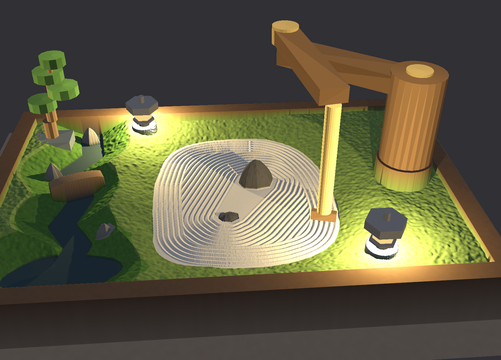
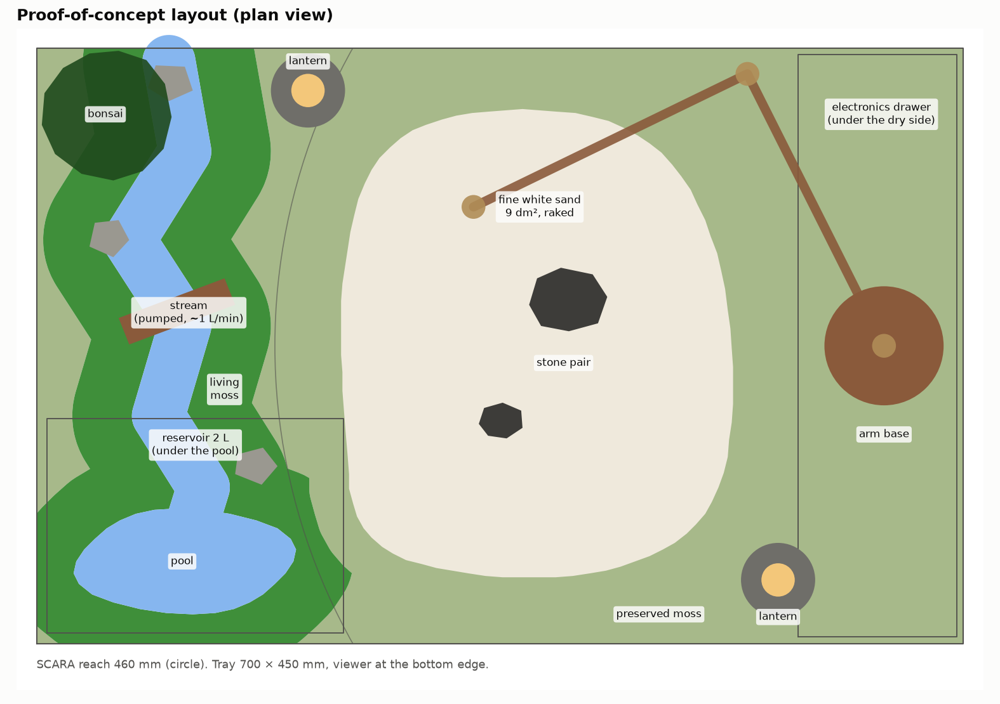
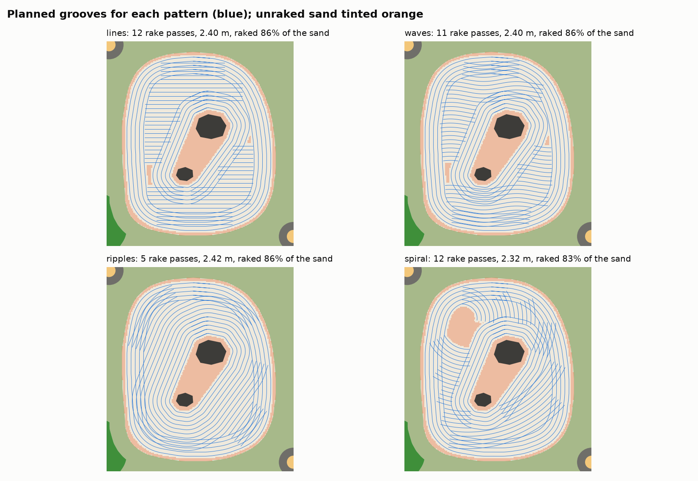
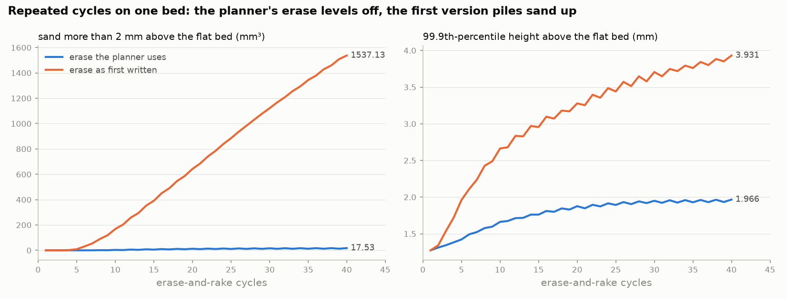

# The plan: a desk-scale living karesansui with a built-in raking arm

**Status.** Designed and checked in silico. Nothing here has been built or measured yet.

- **Where the numbers come from.** Every number is computed by the twin in this repository and written to `docs/*.json` by the scripts in `experiments/`, is taken from a cited datasheet, or is labelled as an estimate.
- **The weak spot.** The sand model's free parameters are guesses until Phase 0. The numbers that depend on them are called out as such.



## 1. What it is

A 70 × 45 cm garden in a walnut tray on a small table, seen from the front:

- **Left (wet side).** A pumped stream runs from a spring rock under a bonsai at the back, past a bridge and stream rocks, to a pool at the front. Living moss grows in a band along the water.
- **Centre.** 9.1 dm² of fine white quartz sand, 25 mm deep, holds a pair of stones. That is 2.3 L, about 3.3 kg at an assumed 1450 kg/m³.
- **Right (dry side).** The arm stands on a walnut column above the electronics drawer. It erases the sand and rakes a new pattern on command.
- **Everywhere else.** Preserved (dry) moss.
- **Light.** Two 90 mm stone lanterns with warm 60 lm LEDs light the grooves in the evening.



## 2. Decisions at a glance

| # | Decision | Why (evidence) |
|---|---|---|
| 1 | **SCARA arm**, links 230 + 230 mm, **NEMA17 steppers with 5:1 GT2 belt reductions** | Groove wobble (95th percentile, across the line) is **0.26 mm**, against 1.5 mm (Dynamixel XM430) and 2.6 mm (STS3215 hobby servo). The base and elbow motors carry no weight. See §3.1. |
| 2 | **Floating comb on a skid**, latched by a servo, with a **screed blade** on the same head | Groove depth follows the sand, not the arm. On a bed rising 4.8 mm along a stroke (the first study's gravel bed), the floating head's groove depth changes by less than 0.3 mm; a rigid head's changes by more than 2 mm (test). |
| 3 | **5 tines at 8 mm pitch** (2.5 mm pins) and a **44 mm blade** | With the first 9-tine head the pattern got only 5–10% of the raking; the rest went to the border and the ring round the stones, so all patterns looked alike. With 5 tines it gets 35–37%. See §3.3. |
| 4 | **Erase = edge loop + lanes + stone rings.** Every loop exits with a quarter turn, and the blade rises over the last 30 mm of every pass. | The first erase piled sand up at pass ends: 1,537 mm³ over 40 cycles and still growing. This one levels off at about 17 mm³. See §3.4. |
| 5 | **Fine white quartz sand, 0.1–0.5 mm, washed** | An 8 mm groove pitch needs grains much smaller than the pitch. This is reasoning; Phase 0 checks it. |
| 6 | **Joint-space G-code on FluidNC** (ESP32). All kinematics and checks run on the host. | No kinematics in firmware. Every program passes `karesansui check` before it runs. |
| 7 | **2 L reservoir under the pool, about 1 L/min, small 12 V pump, float cut-off.** No copper and no chiller. | Evaporation 0.10–0.15 L/day, so a refill every 7–10 days. Hydraulic power is 36 mW. Evaporation cools the water by about 3–4 W. Copper kills moss. See §3.7. |
| 8 | **Bonsai outside the arm's reach, under its own grow light** | The canopy is 564 mm from the arm base; the reach envelope is 520 mm. The lanterns give tens to hundreds of lux; a tree needs thousands. See §3.6 and §3.8. |
| 9 | **Indoors first** | Fine sand does not survive wind, rain or direct sun. The balcony works only under a cover and out of the sun. |
| 10 | **Home Assistant later** | Not built. The machine comes first (Phase 4). |

## 3. What the twin established

### 3.1 The arm

`experiments/arm_study.py` → `docs/arm_study.json`, `docs/figures/arm_wobble.png`.

The study takes every rake pose of every pattern and computes three things: the joint angles, the holding loads, and the line wobble. Line wobble is the tool-point error across the direction of travel when every joint sits anywhere inside its drive's backlash plus resolution.

| Drive (joint output) | SCARA, 95th pct | Articulated, 95th pct |
|---|---|---|
| Hobby servo, Feetech STS3215 (backlash ≤ 0.5°, datasheet) | 2.61 mm | 2.66 mm |
| Smart servo, Dynamixel XM430 (0.25°, ROBOTIS) | 1.50 mm | 1.57 mm |
| NEMA17 + 5:1 GT2 belt (±5% step accuracy; belt backlash taken as 0, an estimate) | **0.26 mm** | 0.28 mm |
| Harmonic drive + encoder (< 1 arcmin) | 0.17 mm | 0.19 mm |

Against an 8 mm groove pitch, the servos bend the lines by a fifth to a third of a pitch; belt-reduced steppers stay near 3%.

**Holding loads.**

- *SCARA:* the base and elbow turn about vertical axes, so they hold no weight. The lift holds the tool's 3.4 N (0.35 kg, an estimate).
- *Articulated:* the arm in Gemini's render holds 2.9 N·m at the shoulder and 0.9 N·m at the elbow all the time. That needs a counterbalance or bigger motors. It is worth doing later for looks, not for the proof of concept.

**Other checks.**

- *Base torque:* acceleration plus drag needs 0.26 N·m at the base, assuming 0.5 N of rake drag (an estimate; Phase 0 measures it).
- *Reach:* the arm reaches 460 mm. The farthest sand is 418 mm from its base.

**Tool yaw.** Over one program the head's yaw winds through 3.8–5.0 full turns. Two ways to handle that:

- a small slip ring, which only the latch servo's three wires need to cross;
- a planner change that unwinds the turns during travel, when the head is lifted.

### 3.2 The rake head

- **Floating comb.** The comb hangs on a vertical slide (25 mm of travel), and a skid 6 mm ahead of it rides on the sand. The comb's depth (5 mm below the skid) is set by the sand, not by the arm's height. For raking, the arm only has to keep the slide inside its travel. The sand test in §2 is the evidence.
- **Narrow skid (16 mm) centred ahead of the comb.** On the tightest planned turn (28.5 mm radius), the skid's corners stay 1.7 mm inside the band the comb sweeps. A skid as wide as the comb would stick out 7.6 mm and touch the stones and edges the planner keeps the comb away from.
- **Turn limits.** Below a 17.25 mm radius the inner tine runs backwards; below 34.5 mm it moves at less than half speed. The planner never goes below 28.5 mm. Each program has about 100 mm of raking between those two limits, at the tightest bends round the stone pair, and the inner grooves there may smear.
- **Latch.** A hobby servo on FluidNC's analog output locks the head up for travel and screeding (`M67 E0 Q10`) and releases it to float for raking (`Q5`). M67 waits for queued motion, so the latch changes exactly between moves.

### 3.3 Four patterns on a small bed

`experiments/comb_study.py` → `docs/comb_study.json`, `docs/figures/poc_patterns.png`.

Every pattern needs a border pass and a ring round the stone pair. On a 9 dm² bed these two can take almost all the raking. The table shows the share of raked length that belongs to the pattern itself. Ripples are nothing but rings, so their share is 0% by definition.

| Head and layout | lines | waves | spiral | rake coverage | erase coverage |
|---|---|---|---|---|---|
| 9 tines, 76 mm blade (first design) | 10% | 10% | 5% | 83% | 92% |
| 9 tines, stones moved back-right | 16% | 16% | 8% | 79–80% | 88% |
| **5 tines, 44 mm blade (chosen)** | **37%** | **37%** | **35%** | **83–86%** | **92%** |
| 5 tines, stones moved back-right | 46% | 47% | 44% | 79–84% | 91% |

All variants plan with zero collisions. Moving the stones off-centre, toward the back-right, would add another 10 points of pattern share. It is also the more traditional composition. Where the stones go is your call: it is one config edit and a re-run.

**What stays unraked (13–17%).** Three places, which you smooth by hand once when you build the garden:

- the gap between the two stones (the head doesn't fit);
- a few millimetres along the sand's edge;
- the eye of the spiral.

§3.4 shows the machine doesn't pile sand into them.



### 3.4 Erasing without piling sand up

`experiments/erase_study.py` → `docs/erase_study.json`, `docs/figures/erase_cycles.png`.

The screed blade carries a berm of sand and drops it where a pass ends. If that spot is sand no pass sweeps, the pile grows every cycle. Running many cycles on one bed exposed this in the first erase design:

- it only flattened part of the bed (straight lanes can't reach a curved edge);
- every lane ended in the same place.

The fix has three parts:

1. a screed loop along the sand's edge;
2. a quarter turn at the end of every loop, away from the unswept strips;
3. a blade that rises 3 mm over the last 30 mm of every pass, laying its load down as a thin wedge.

After 40 cycles of ripples and lines in turn:

| | sand piled > 2 mm above the bed | 99.9th-percentile height | still growing? |
|---|---|---|---|
| **Erase the planner uses** | 17.5 mm³ | +1.97 mm | no, levelled off |
| Erase as first written | 1,537 mm³ | +3.93 mm | yes, about 50 mm³ per cycle |

A unit test repeats this over eight cycles, with the old erase as a negative control. The erase now passes the blade over 92.5% of the open sand.



### 3.5 Grooves and cycle time

- **Grooves.** The simulated cross-section shows 2.5 mm crest to trough at 8 mm pitch (`docs/figures/groove_profile.png`), and the raked bed spans −1.65 to +1.44 mm around flat. These numbers depend on the uncalibrated sand parameters: treat them as the shape of the answer, not the answer.
- **Cycle time.**
  - An erase plus a pattern takes **8.9–10.0 minutes** of machine time and 10–11 thousand lines of G-code.
  - Nearly half of that (3.6–4.6 min) is the head going up 100 mm and back down, at 20 mm/s, between 22–29 passes.
  - A faster lift, or a lower travel height where nothing tall is near, would cut that. It hasn't been optimised; it doesn't matter for something you watch.

### 3.6 Light

`docs/figures/poc_lux.png`.

- **What the lanterns give the sand.** Each lantern has a 60 lm LED 55 mm above the sand; the room adds 15 lux. The raked sand gets **14 / 45 / 173–184 lux** (5th percentile / median / 95th). That low, warm light is what makes the grooves read in the renders.
- **What the plants need.** Treat the lanterns as decoration: one gives about 480 lux at 100 mm and 120 lux at 200 mm.
  - *Bonsai:* care guides for indoor bonsai (Ficus and similar) ask for bright light for 6 hours or more a day, in the thousands of lux.
  - *Moss:* sources disagree by an order of magnitude.

  Either way the plants need **a separate dimmable grow light over the living side**, on a timer, off in the evening when the lanterns are on.

### 3.7 Water

`water.py` → `docs/poc_results.json`.

| Quantity | Value |
|---|---|
| Open water (stream 40 mm wide + pool) | 0.026 m² |
| Living-moss band (≤ 45 mm from water, ≥ 30 mm from sand) | 0.048 m² |
| Evaporation (22 °C, 45% RH air; ASHRAE pool formula) | 0.10 L/day (water only) to 0.15 L/day (plus moss wet half the time) |
| Days until the 1 L usable half of a 2 L reservoir is gone | 6.8–9.9 days |
| Pump duty at 1 L/min, 80 mm lift, 0.7 m of 6 mm tube | 0.22 m head, 36 mW hydraulic |
| Stream depth on a smooth bed (Nusselt film, lower bound) | 1.0 mm at 0.42 m/s (Froude number 4.2) |
| Example pump rated 3 m / 4 L/min, unthrottled | runs at 2.7 L/min: throttle it (valve or PWM) |

What follows from it:

- **Pump.** Any small 12 V DC fountain pump with a flow adjuster will do. PC-cooling pumps (D5/DDC class) are built for metres of head and many litres per minute; this loop needs neither.
- **No chiller.** Evaporation takes 0.10–0.15 L/day out of the water, about 3–4 W of cooling. The water sits at or a little below room temperature.
- **Top up with distilled or rain water.** Evaporation leaves the minerals behind. A month of tap-water top-ups concentrates them 2.5–3.2× (white crust on stones and moss).
- **"Babbling" needs steps.** A smooth channel carries this flow as a 1 mm sheet, fast and nearly silent. Build the stream as drops of 10–20 mm over stones, and tune the sound on the bench (Phase 2): the twin can't model sound.
- **No copper anywhere wetted.** Copper is a moss killer: it is sold as a roof moss treatment, and it is toxic to aquatic mosses. Wetted parts should be glass, glazed ceramic, 316 stainless, silicone, PP or PE, or EPDM liner.
- **Keep the sand dry.** Living moss stays at least 30 mm from the sand, and the sand sits in its own sealed basin with a low kerb. Damp sand rakes differently and grows algae.

### 3.8 The bonsai

- **Position.** A shohin-size tree (about 190 mm tall, canopy about 100 mm across) sits in the back-left corner at the head of the stream, in the living moss.
- **Clearance.** It is taller than the arm's travel height, so it must be out of reach entirely. The canopy is 564 mm from the arm base; the check envelope is 520 mm (460 mm reach plus the head plus a margin). The planner checks this on every program, and a test shows the same tree 100 mm closer is flagged.
- **It grows.** Trim it, and re-measure the canopy in the config when it changes.
- **Species.** Indoors, pick one sold as an indoor bonsai, such as Ficus or Portulacaria afra. Pines, junipers and maples need to be outdoors and go dormant in winter.
- **Drainage.** The pot drains into the living-moss bed, and that bed drains to the reservoir.

## 4. Build

### 4.1 Mechanics

- **Base (q1) and elbow (q2).** NEMA17 steppers, each with a 20T:100T GT2 belt (5:1) and a pair of preloaded bearings per joint. The elbow motor sits at the base and drives through the upper link, which keeps the links light.
- **Lift (z).**
  - A small stepper on a T8 lead screw (or a belt), with 110 mm of stroke: z = 0 is the latched blade on the sand, 100 mm is travel height.
  - Link undersides sit 175 mm above the sand, above the 90 mm lanterns and the stones (the taller stands 45 mm above the sand).
- **Tool yaw (q4).**
  - A small stepper with a 3:1 belt.
  - A 6-circuit capsule slip ring carries the latch servo's three wires; the alternative is unwinding during travel, a planner change.
  - A hall sensor gives the index.
- **Head.**
  - *Slide:* a vertical linear slide, 25 mm of travel.
  - *Skid:* POM or brass, 22 × 16 mm.
  - *Comb:* five 2.5 mm stainless pins at 8 mm pitch, tips 5 mm below the skid.
  - *Blade:* a 44 × 4 mm screed blade.
  - *Latch:* a micro servo locks the slide.
- **Links.** Walnut, laminated to aluminium flat bar for stiffness. The twin assumes rigid links (§8).
- **Homing.** Limit switches on q1, q2 and z. FluidNC soft limits must match the joint limits in `configs/poc.toml`; the twin's `check` enforces the same limits.

### 4.2 Electronics and control

- **Controller.** An ESP32 board running FluidNC with at least four TMC2209 drivers, for example V1 Engineering's Jackpot or Bart Dring's 6-Pack. Check the current specifications before buying.
  - FluidNC supports G93 inverse-time feed, M62–M68 and A/B/C axes. This was checked in its `GCode.cpp`.
  - TMC2209 StealthChop keeps the steppers quiet.
- **Axes.** X = q1, Y = q2, Z = lift, A = yaw, in degrees and millimetres.
- **Workflow.**
  1. `karesansui plan <pattern> -o file.gcode`
  2. `karesansui check file.gcode`
  3. Stream the file to FluidNC over USB or Wi-Fi.
- **Power.** One external, certified 24 V adapter, with a buck converter to 12 V for the pump, LEDs and servo. Nothing at mains voltage inside the tray.
- **Water safety in hardware.**
  - A float switch in the reservoir cuts the pump's power directly, not through software, before it runs dry.
  - A leak sensor on the drawer floor.
  - Drip loops on every cable.
- **Electronics drawer.** Under the dry right-hand side, raised above the highest water level. The arm's column mounts to the frame, not to the drawer.

### 4.3 Materials and the wet/dry split

- **Tray.** Walnut frame on a plywood base.
  - The wet side (stream, pool, living moss) is lined with EPDM or sealed with epoxy.
  - The sand is a separate sealed basin with a 5–10 mm kerb.
  - All fasteners are stainless.
- **Reservoir.** Dark (no light, no algae), with a lid, and a sponge pre-filter on the pump intake.
- **Stream bed.** Built from stones and glazed pieces set in the liner.
- **Sand.** Washed quartz sand, so there are no fines to raise dust.

## 5. Bill of materials

Rough estimates in euros from typical hobby prices. **Not checked against current listings: verify before buying.**

| Group | Items | Estimate |
|---|---|---|
| Arm drives | 4 × NEMA17 (or NEMA14 for yaw and lift), GT2 belts and 20T/100T pulleys, T8 lead screw and nut, 8 bearings | €90–160 |
| Arm structure | Walnut and aluminium flat bar for links and column, fasteners, 3D-printed or turned hubs | €40–90 |
| Head | Linear slide, stainless pins, POM skid, blade, micro servo, 6-circuit slip ring, hall sensor | €30–60 |
| Control | ESP32 FluidNC board with TMC2209 drivers, 3 limit switches, 24 V adapter (60–100 W), 12 V buck, wiring | €80–180 |
| Water | 12 V DC pump with adjuster, float switch, leak sensor, silicone tube, sponge filter, reservoir, EPDM or epoxy | €50–100 |
| Garden | Washed white sand (5 kg), two stones, stream rocks, living and preserved moss, shohin bonsai, two small lanterns with 2200 K LEDs, grow light | €120–260 |
| Tray | Walnut boards, plywood base, sealant and finish | €80–200 |
| **Total** | | **roughly €500–1,050**, most of the spread being wood and the bonsai |

## 6. Phases and exit criteria

**Phase 0: bench calibration (a weekend or two, no arm).**

- *Measure:*
  - the sand's angle of repose (funnel cone) and bulk density (weigh 1 L);
  - the groove profile left by a hand-pulled 5-tine comb on a guided jig at 5 mm depth (depth gauge, or a photographed laser line);
  - the drag on that comb (luggage scale);
  - how well a 44 mm blade erases a raked patch;
  - lantern illuminance on the sand (a phone lux meter is enough to check the order of magnitude).
- *Then:* put the values into `configs/poc.toml`, fit the sand model's throw parameters to the measured profile, and re-run the experiments.
- *Exit:*
  - the simulated groove cross-section matches the measured one within ±0.5 mm, or you know which model term is wrong and by how much;
  - measured drag is at or below the 0.5 N the drives were sized for.

**Phase 1: the arm, dry.** SCARA on a board beside a sand tray of the proof-of-concept shape. FluidNC limits set from the config; every program generated with `plan` and verified with `check`.

- *Exit:*
  - 20 consecutive erase-and-rake cycles with no collision and no lost steps;
  - measured groove wobble at the 95th percentile ≤ 0.5 mm (photograph against a straight edge);
  - grooves unbroken through the 28.5 mm bends;
  - the bed stays within ±2.5 mm of flat over those 20 cycles (compare with §3.4).

**Phase 2: water, on the bench.** Reservoir, pump and a mock-up of the stream in a tray.

- *Exit:*
  - 7 days without a leak;
  - measured evaporation compared with 0.10–0.15 L/day;
  - the float cut-off stops the pump in a drain test;
  - the stream tuned until it sounds right.

**Phase 3: the garden.** Walnut tray, liners, sand basin and kerb, living moss with drainage to the reservoir, preserved moss, lanterns, the bonsai under its grow light, the arm and the drawer.

- *Exit:* two weeks of one cycle a day, unattended, with dry sand, living moss, no leaks, and the bed within Phase 1's bounds.

**Phase 4: later.**

- Home Assistant over MQTT: pattern select, pump, lanterns, grow-light schedule.
- The articulated show arm, with a counterbalance.
- A camera check of the grooves.

## 7. Risks, bluntly

1. **Groove quality is unknown until Phase 0.** The sand model's free parameters are guesses, and it is the risk everything else rests on. Cheap to retire: a comb, a jig and a tray of sand.
2. **Damp sand.** Humidity from the living side makes fine sand cohesive and changes how it rakes. It is handled with a sealed basin, a 30 mm dry buffer and no misting near the sand, and still worth watching in Phase 3.
3. **The arm is the most expensive and fiddliest part** (belts, homing, the slip ring). Phase 1 is where the budget goes.
4. **Noise** from steppers and the pump in a quiet room. StealthChop helps, and you run cycles when you're there to watch anyway.
5. **Living things change.** The bonsai grows toward the arm's envelope, and moss spreads or dies back. Trim, re-measure, re-check.
6. **Water chemistry.** Minerals concentrate and algae appears. Top up with distilled water, keep the reservoir dark and clean it weekly.
7. **Cycle time (about 10 min)** is half lifting. It is fine for watching and easy to cut later.

## 8. What the twin cannot tell you

- **Sand.**
  - The heightfield model is mass-exact and respects the angle of repose, but the throw parameters (how far a tine pushes sand sideways and forwards, the ring width, the skid's contact percentile) are uncalibrated.
  - It has no grain-scale physics, cohesion or humidity.
  - Absolute relief changes by about 8% between 1 mm and 0.5 mm grid cells, so it isn't converged in absolute terms.
- **Arm.** Links are rigid. There is no belt stretch, bearing play beyond the drive figures, or thermal drift. The belt backlash (0) and the tool mass (0.35 kg) are estimates, and so is the rake drag (0.5 N).
- **Water.**
  - The evaporation formula is for swimming pools, applied to a 2.6 dm² stream.
  - The moss term (wet half the time, still-water factor) is a guess worth ±50%.
  - The stream depth is a smooth-bed lower bound, and the model has nothing to say about sound.
- **Light.** Lambertian surfaces, no inter-reflection. Lux values are first order; the renders are illustrations.
- **Not modelled at all:** noise, dust, plant health, how it feels to watch.

## 9. What changed from the Gemini plan

| Gemini plan | This plan | Why |
|---|---|---|
| 120 × 80 cm tray on casters, 85 kg of 2–4 mm grit | 70 × 45 cm table garden, 3.3 kg of 0.1–0.5 mm sand | Your table, your vision; grains much smaller than an 8 mm groove pitch |
| A separate mobile dual-arm robot, camera and ArUco registration | An arm built into the garden, homed to it | The picture you showed; no registration error, no vision stack |
| 4.5 N force-controlled (impedance) raking | A floating comb on a skid | Depth follows the sand passively (tested) |
| 5 tines at 25 mm pitch | 5 tines at 8 mm pitch | Desk scale; pattern share on a small bed (§3.3) |
| Waves with λ = 60 mm, A = 15 mm | Waves derived from the comb (λ 128 mm, A 3.8 mm) | The original shape needs a 6.1 mm turn radius; the comb can't turn tighter than 17.25 mm without its inner tine running backwards (test) |
| Rim LED strips at < 15° | Two lanterns for raking light, plus a grow light for the plants | The picture; plants need far more light than the grooves do |
| Home Assistant from the start | Phase 4 | The machine comes first |
| (Earlier chat) copper basin, compressor chiller, D5/DDC pumps | Glass, glazed or stainless; no chiller; a small 12 V pump, throttled | Copper kills moss; 3–4 W of evaporative cooling; 36 mW of pumping needed |
| Keystones anchored through the base | Kept (glued or pinned) | Agreed |

## 10. Reproduce

```bash
pip install -e ".[dev]"
python experiments/poc_run.py       # the garden end to end: docs/poc_results.json + figures
python experiments/arm_study.py     # §3.1
python experiments/comb_study.py    # §3.3
python experiments/erase_study.py   # §3.4 (about two minutes)
pytest                              # the checks listed in README.md
```
