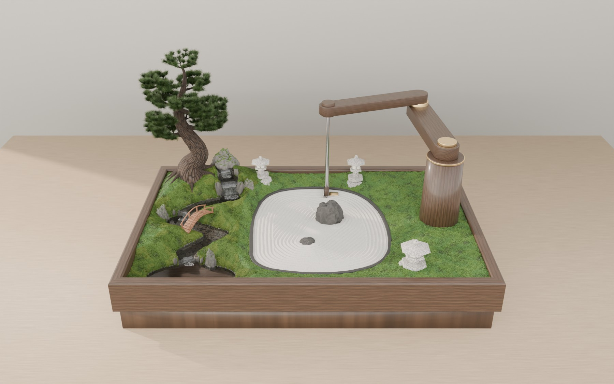

# karesansui: the in-silico twin

A Python model of the proof-of-concept table garden: a 70 × 45 cm living garden (moss, a pumped
stream, a bonsai, three lanterns) with a bed of fine white sand that an arm built into the garden
rakes. Everything the build plan claims is computed here and can be re-run.

- **[PLAN.md](PLAN.md)**: what to build, why, in what order, and what is still unknown.
- **[BOM.md](BOM.md)**: the bill of materials, line by line, with the quantities computed from the model ([docs/bom.csv](docs/bom.csv) for a spreadsheet).
- **[docs/garden3d.html](docs/garden3d.html)**: the garden in 3D. Open it in a browser (it needs WebGL 2, and loads Three.js from jsDelivr) to watch the arm erase and rake each pattern along its planned path.
- **[docs/renders/](docs/renders/)**: photoreal renders of the same model, made with Blender Cycles.
- **This file**: how to run the twin and what each part does.



## Install

Python 3.11 or newer.

```bash
cd zen-garden
python -m venv .venv && . .venv/bin/activate
pip install -e ".[dev]"
```

The first run compiles the numba kernels, which takes a few tens of seconds. They are cached after that.

## Use

```bash
karesansui plan ripples -o out/ripples.gcode          # plan for the SCARA arm in configs/poc.toml
karesansui check out/ripples.gcode --png out/top.png   # strict parse, joint limits, clearances,
                                                      # replay on the sand model, top view
python experiments/poc_run.py     # the garden end to end: figures + docs/poc_results.json (about a minute)
python experiments/arm_study.py   # which arm, which drives (seconds)
python experiments/comb_study.py  # comb width and stone placement vs pattern variety (seconds)
python experiments/erase_study.py # 40 erase-and-rake cycles: does sand pile up? (about two minutes)
python experiments/export_3d.py   # rebuild the 3D viewer from the model (about a minute)
python experiments/export_render_scene.py    # the model as a bundle for the photoreal renderer (seconds)
python experiments/bom.py         # the bill of materials, quantities from the model: BOM.md, docs/bom.csv (seconds)
python render/garden_cycles.py --views front,evening,stream,sand,arm,tree --quality preview
                                  # photoreal renders on the CPU; needs `pip install bpy==5.0.1` (Python 3.11)
render/colab_render.sh            # the same at final quality on a Colab GPU (see "Rendering on Colab")
pytest                            # the checks listed below (about a minute)
```

- **Options:** `plan` takes `lines`, `waves`, `ripples` or `spiral`. Both commands take `--config` (default `configs/poc.toml`) and `--arm scara|articulated`.
- **What `plan` checks before writing G-code:** collisions with the sand edge and stones, arm reach and joint limits, obstacle clearance while travelling, and turn radii against the comb's limits. If any check fails, no G-code is written.
- **Exit status:** 0 ok, 1 failed a check, 2 bad input.
- **Where output goes:** `out/`, which git ignores.

## What is where

| Path | Contents |
|---|---|
| `configs/poc.toml` | The proof of concept: tray, sand outline, stones, rake, arm, water, lanterns, features (mm) |
| `configs/garden.toml` | The first study: a 120 × 80 cm gravel tray with a gantry (kept as a second test case) |
| `src/karesansui/config.py` | Dataclasses and the TOML loader |
| `geometry.py` | Head footprint, allowed regions, path resampling and curvature |
| `patterns.py` | Lines, waves, ripples and spiral; stone islands and their rings; the border frame pass |
| `planner.py` | Rake and erase passes, trimming, collision and reach checks, travel, coverage, the program report |
| `arm.py` | SCARA and 5-joint articulated kinematics, joint limits, holding loads, line-wobble error budget |
| `gcode.py` | Joint-space G-code for FluidNC (G93 inverse-time feed, M67 rake latch); a strict interpreter and replay |
| `sim.py` | Heightfield sand: tine carving, floating skid, screed blade, mass-exact angle-of-repose relaxation (numba) |
| `render.py` | Baked lantern lighting with shadows, colour temperature, a perspective rasteriser, meshes for the arm, lanterns and bonsai |
| `water.py` | Stream reaches and cascades, evaporation, pump operating point, pipe losses, film depth, the living-moss zone |
| `landscape.py` | The ground around the sand: hill, valleys and banks, stream bed, kerb, the rim of the frame, water surface, zones |
| `bonsai.py` | The tree the pictures draw: an informal-upright pine grown to fit the model's tree (its height and canopy outline) |
| `viz.py` | Plan-view drawings |
| `cli.py` | `karesansui plan` and `karesansui check` |
| `viewer/garden3d.template.html` | The Three.js viewer; `export_3d.py` inlines the model's data into it as `docs/garden3d.html` |
| `render/garden_cycles.py` | The photoreal renderer: builds the exported model in Blender and renders it with Cycles |
| `render/colab_render.sh`, `colab_job.py`, `colab_login.py` | The same render on a Colab GPU through Google's Colab CLI, and a two-step sign-in for headless machines |
| `experiments/` | `poc_run.py` (the whole garden, end to end), `arm_study.py` (which arm, which drives), `comb_study.py` (pattern variety), `erase_study.py` (sand over many cycles), `export_3d.py` (the 3D viewer), `export_render_scene.py` (the bundle for the renderer), `bom.py` (the bill of materials) |
| `docs/` | `poc_results.json`, `arm_study.json`, `comb_study.json`, `erase_study.json` and `figures/`, all written by the experiments |

## What the tests pin down

Every test runs on the real configs and on programs generated by the planner, compared against closed-form results, published reference values or a negative control. None of them uses made-up fixtures.

- **Planning.**
  - Every pattern plans with zero collisions for both arms.
  - No turn is tighter than the comb's hard limit.
  - Grooves keep the pitch.
  - The rake covers at least 80% of the open sand and the erase at least 90%.
  - The original 60 mm / 15 mm wave spec is rejected.
  - Anything taller than the travel lift is checked against everywhere the head and links can reach inside the joint limits.
  - The bonsai clears that envelope, and the same tree with the joints free is inside it.
- **Kinematics.**
  - IK inverts FK.
  - Jacobians match finite differences.
  - The joint-limit check accepts exactly what the IK calls reachable.
  - Holding torque and line wobble match hand calculations.
- **G-code.**
  - Every planned pose is a commanded point.
  - Joint-space chords stay on the path.
  - The rake runs released and the screed latched.
  - Pass timing matches the configured speeds.
  - Unmodelled codes are rejected.
  - The CLI round trip catches an unsupported code, a joint 5° past its stop and a head driven into a stone.
- **Sand.**
  - Mass is conserved to 1e-12.
  - Piles relax to the angle of repose.
  - Grooves sit under the tines, with symmetric ridges.
  - The floating skid holds groove depth on a tilted bed where a rigid head does not.
  - The screed erases without losing sand.
  - Over eight erase-and-rake cycles less than 10 mm³ of sand piles up more than 2 mm above the bed. The negative control, the erase as first written, piles up more than 40 mm³.
  - Living moss stays at least 30 mm from the sand.
- **Rendering.**
  - CIE illuminant A lands on the published chromaticity.
  - A point light obeys the inverse-square cosine law.
  - Walls cast shadows that low kerbs don't.
- **Landscape.**
  - No water stands above its banks, and every stream bed lies under its water.
  - The frame is one height all round. At every wall the ground stays 5 mm below its rim.
  - The frame is as low as the spring allows. Two negative controls fail: a frame 5 mm lower overflows the spring pool, and the spring rock as first drawn leaves the bank behind it 12 mm short.
  - Every lantern stands on its ground: its body is tall enough, with its LED in the firebox. The spring lantern as first specified, with its LED 14 mm above its foot, fails.
  - The sand is flat.
- **Bonsai (the tree the pictures draw).**
  - Every needle tip, placed exactly as the renders place it, stays inside the canopy outline the arm keeps clear of, and under the tree's height.
  - The trunk tapers strongly, and the first pad sits at about a third of the height.
  - A smaller canopy grows a smaller tree that still fits.
- **Water.**
  - Vapour pressure matches steam tables.
  - Evaporation matches a hand calculation.
  - Friction is laminar below transition and Blasius above.
  - The pump operating point lies on both curves.
  - The stream film obeys the Nusselt relation.
  - Reach falls plus cascade drops add up to the stream's total drop.
  - Every cascade has its plunge pool.
  - The water stays at least 40 mm from the sand.

## Rendering on Colab

`render/colab_render.sh` exports the model and uploads it with `render/garden_cycles.py` to a Colab GPU. There, `colab_job.py` fetches Blender 5.0.1 (Colab's Python is 3.12 and the `bpy` wheels are 3.11-only), renders every view with GPU Cycles, and downloads the images to `out/renders_colab/`. The VM is always released.

It needs three things:

- **The CLI.** `pip install google-colab-cli` (Python 3.12 or newer).
- **Network access to Colab.** The CLI talks to `colab.research.google.com`, `colab.pa.googleapis.com` and `oauth2.googleapis.com`, and then to the VM through a proxy URL that Colab assigns with the VM, so that host is not known in advance. In a Claude Code cloud environment, set Network access (environment settings, Edit) to a level that allows these, or add the three hosts to the allowed domains and then the proxy host once the first run names it.
- **A one-time sign-in.** At a terminal, run `colab --auth=oauth2 sessions`. On a headless machine, run `python render/colab_login.py url`, open the link, then run `python render/colab_login.py code <CODE>`.

## What it cannot tell you

The model's free parameters (how far a tine throws sand, the skid's contact, grit properties) are guesses until the Phase 0 bench measurements in PLAN.md. Absolute groove depths are therefore uncertain. The model also doesn't cover:

- grain-scale physics or humidity;
- link deflection, belt stretch or thermal drift in the arm;
- the sound of the stream;
- plant health.

PLAN.md §8 lists these limits in full.
